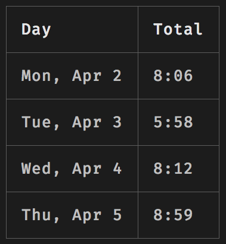
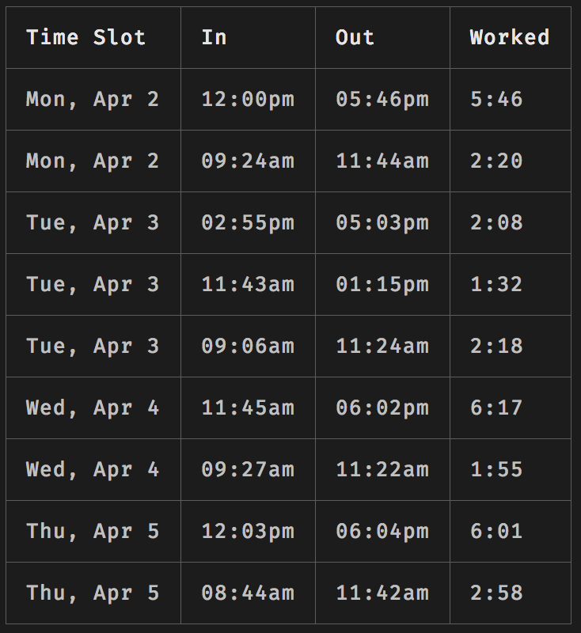
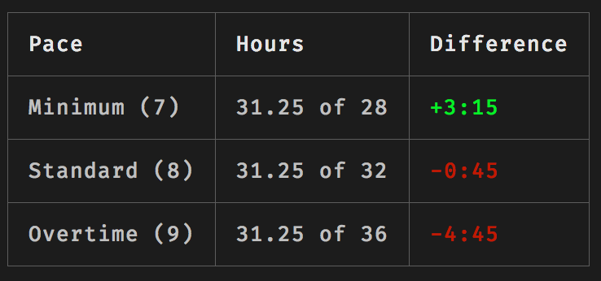

# When I Work

**Notice:** This CLI is not affiliated with the WhenIWork company, it's just a side project built by a nerdy developer that works with the WhenIWork API.

A command-line-tool for displaying my information for the week.

## Screenshots

So what's this thing look like anyways?





## Setup

Install the package:

```bash
$ npm install -g wheniwork-cli
```

Add `~/.wheniwork` to your home directory (`$HOME`) with the following credentials:

```bash
WHENIWORK_USERNAME={your account email address}
WHENIWORK_PASSWORD={your account password}
WHENIWORK_KEY={your api key}
```

Run the following command to make a login request to get your API token:

```bash
$ wheniwork -l
```

This command will return the following information:

```bash
WHENIWORK_USERID={your user id}
WHENIWORK_TOKEN={your access token}
```

Copy and paste those values into your `~/.wheniwork` file and you should be all set!

Please [submit an issue](https://github.com/joshmedeski/wheniwork-cli/issues/new) if you are having problems getting this to work

## Using

To use the `wheniwork-cli`, simply type `wheniwork` in your terminal:

```bash
$ wheniwork
```

Adding a flag (see `$ wheniwork -h`) shows more tables. My personal favorite is the pace table (`-p`) which will show your current working pace and calculates how many hours you should work to match the expected pace you're going for.

## Contributing

Feel free to make a pull request on this project! It's just a little utility I use everyday to keep track of my working hours. If you're too lazy, you can [make an issue](https://github.com/joshmedeski/wheniwork-cli/issues/new) to request a new feature or submit a bug.
